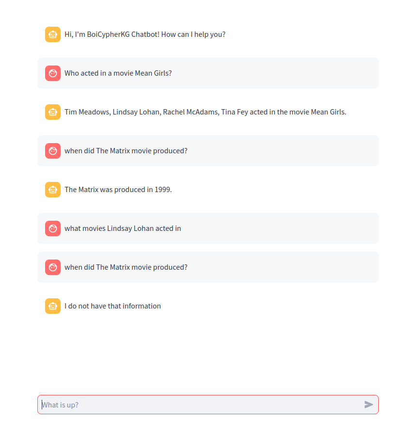

# Neo4j LLM Chatbot

Welcome to the Neo4j LLM Chatbot! This application leverages the power of LangChain and Neo4j to provide an interactive movie expert chatbot. Powered by the rich movie database from The Movie Database (TMDb), our chatbot offers detailed responses about movies, actors, and directors.
## Features
#### Conversational Interface: 
Engage in natural conversations about movies and receive accurate and relevant information.
#### Dynamic Query Handling: 
Uses Neo4j's graph database capabilities to answer questions based on the movie schema, including relationships between movies, actors, and directors.
#### Tool Integration: 
Equipped with various tools for general movie chat and specific queries using Cypher, the query language for Neo4j.

## How It Works
#### Chat Setup: 
    The chatbot initializes with a prompt that defines its role as a movie expert, ready to assist users with their queries.
#### Session Management: 
    Each conversation is tracked, allowing for a more personalized experience.
#### Response Generation: 
    User inputs are processed to generate responses using a powerful language model, ensuring accurate and engaging replies.
## Demo
Below is a screenshot of the chatbot in action:

## Installation

To get started, clone this repository and install the required dependencies:

    git clone https://github.com/IbnuEyni/neo4j-llm-chatbot.git
    cd neo4j-llm-chatbot
    pip install -r requirements.txt

## Usage
Run the chatbot using Streamlit:

    streamlit run app.py

Example Interaction

    User: "Who directed Inception?"
    Bot: "Christopher Nolan directed Inception."

## Contribution

Contributions are welcome! Please feel free to submit a pull request or open an issue for any enhancements or bugs you find.